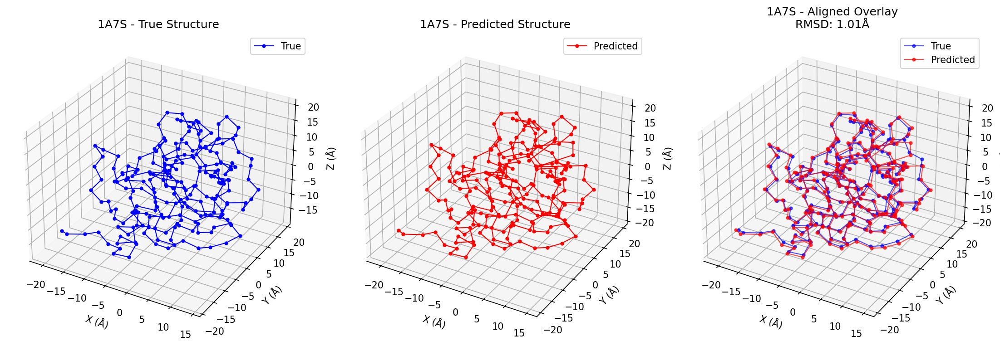
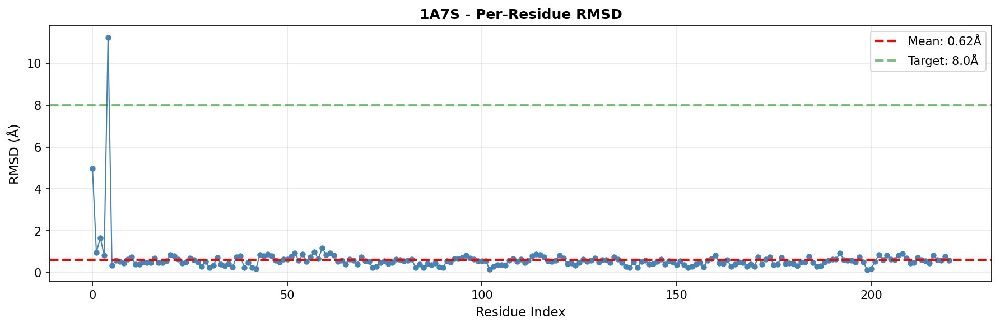

# Takens-Based Transformer for Protein Structure Prediction

**A proof-of-concept demonstration that protein folding can be treated as trajectory reconstruction in conformational phase space, using Takens' Delay Embedding Theorem in place of attention.**

---

## Why This Repository Exists

This repository exists for three reasons.

**First**, it provides a complete, reproducible implementation of a Takens-based approach to protein structure prediction. The code, training pipeline, example datasets, and evaluation tools are all included so that others can independently test, reproduce, modify, and extend the work.

**Second**, it serves as a public record of an alternative architectural approach. Modern protein structure prediction is dominated by attention-based systems and increasingly large computational budgets. The present work explores a different path: treating protein folding as a nonlinear dynamical system and reconstructing conformational geometry using Takens delay embeddings. Whether this approach ultimately succeeds or fails at scale is a question for experiment rather than speculation.

**Third**, it is intended as an open invitation to further investigation. The current results were obtained on consumer hardware using a relatively small training set and should be viewed as a proof-of-concept demonstration of architectural viability rather than a final solution. The repository is therefore offered as a foundation upon which others may build, test, critique, and improve.

The central claim of this repository is modest: a Takens-based architecture can reconstruct coherent protein geometry from amino-acid sequences under the training conditions reported here. Broader questions of generalisation, scaling behaviour, and comparative performance remain open and are expected to require substantially larger datasets and computational resources.

Science progresses through reproducible artefacts. Whatever the eventual outcome of this line of research, the implementation, methods, results, and assumptions are preserved here in a form that can be independently examined and evaluated.


---

## The Result



Protein **1A7S** (227 residues) predicted with **1.01Å overall RMSD** and **0.62Å mean per-residue RMSD** against the known structure — well under the 8.0Å threshold for a recognisable fold.



This result was achieved on **consumer CPU hardware**, with a **small training set**, using a **15M parameter model** trained from scratch. The architecture does not use attention, positional encodings, or any components from the standard transformer stack.

> **Note:** This is a proof-of-concept demonstrating architectural viability, not a competition with AlphaFold. The generalisation limitation — the model performs well on proteins geometrically similar to those in training — is a known consequence of the small dataset, not the architecture. The result shows the approach works. Scaling to larger datasets is the natural next step.

---

## The Core Idea

Standard protein structure prediction treats the problem as a **sequence-to-structure mapping**: given an amino acid sequence, predict the 3D coordinates. The architecture learns statistical associations between sequence patterns and structural outcomes.

This work treats it differently.

Protein folding is a **nonlinear dynamical process**. The polypeptide chain explores conformational space as it folds, following trajectories governed by physical forces. The final folded structure is an **attractor** — a stable geometric configuration that the trajectory converges to. The amino acid sequence is the observable that drives the system; the 3D structure is the phase space geometry being reconstructed.

From this perspective, the right mathematical tool is **Takens' Delay Embedding Theorem** (1981), which guarantees that the phase space geometry of a nonlinear dynamical system can be reconstructed from a single observable time series using delay coordinates:

```
x(t) = [e(t), e(t-τ₁), e(t-τ₂), e(t-τ₄), e(t-τ₈), ...]
```

This is exactly what the architecture does. Rather than comparing every residue to every other residue (attention, O(N²)), it reconstructs the conformational trajectory from exponentially-spaced delay coordinates (O(N), fixed memory).

The same architecture — with identical mathematical foundations — has been demonstrated to work for language modelling. That it also works for protein structure prediction is evidence that the Takens framework captures something real about the dynamics of both systems.

---

## Architecture: MARINA

The model is called **MARINA** (Manifold-Aware Reconstruction and Inference Network Architecture). It consists of four components:

**1. Residue Encoder**  
Maps amino acid three-letter codes to learned embedding vectors. 20 standard amino acids plus handling for non-standard residues.

**2. Exponential Takens Embedding**  
The core of the architecture. For each residue position `t`, constructs a delay-coordinate vector:
```
x(t) = [e(t), e(t-1), e(t-2), e(t-4), e(t-8), e(t-16), e(t-32), ...]
```
The exponential spacing captures structure at multiple scales simultaneously — local backbone geometry (short delays), secondary structure (medium delays), and domain-level topology (long delays). Memory footprint is O(1) regardless of sequence length.

**3. Adaptive Manifold Projection**  
A learned linear projection compresses the high-dimensional delay vector onto a lower-dimensional semantic manifold. The projection matrix learns which timescales are most informative for the prediction task. This layer is the model's representation of the conformational manifold.

**4. Coordinate Prediction Head**  
Predicts (x, y, z) coordinates for each Cα atom from the manifold state. Trained with mean squared error loss in Ångström space.

No attention. No positional encodings. No key-value cache. No quadratic scaling.

### Architecture Comparison

| Property | Standard Transformer | MARINA (TBT) |
|---|---|---|
| Context mechanism | Multi-head attention | Exponential delay embedding |
| Complexity | O(N²) | O(N) |
| Memory growth | O(N) KV-cache | O(1) fixed buffer |
| Hardware requirement | GPU recommended | CPU sufficient |
| Interpretability | Attention weights | Manifold geometry |

---

## The Duplication Training Strategy

A key methodological finding: deliberately duplicating training samples **improves** geometric learning rather than causing overfitting.

Under standard statistical learning theory, duplicating training data provides no new information and should not improve validation performance. However, in a Takens-based architecture the model is learning **manifold geometry** rather than statistical patterns. Repeated exposure to the same protein deepens the attractor basins and thickens the learned conformational trajectory through phase space. This strengthens the geometric structure of the manifold, which benefits all trajectories through it — including those from validation proteins with similar geometry.

This was first demonstrated in the language modelling experiments (see the companion TBT paper), where the train/validation gap collapsed toward zero with repeated exposure, inconsistent with overfitting but consistent with geometric learning. The same effect is used here in the preprocessing pipeline.

---

## Repository Structure

```
takens-protein-folding/
│
├── README.md                    ← this file
├── LICENSE                      ← MPL-2.0
├── requirements.txt             ← dependencies
├── .gitignore
├── config.py                    ← set your paths here
│
├── core/                        ← TBT architecture (domain-independent)
│   ├── takens_embedding.py      ← Takens delay embedding module
│   └── tbt_architecture.py      ← TBT layers and language model
│
├── protein/                     ← protein-specific components
│   ├── protein_encoder.py       ← amino acid vocabulary and encoding
│   ├── protein_dataset.py       ← dataset loading and batching
│   └── metrics.py               ← RMSD, GDT_TS, TM-score
│
├── pipeline/                    ← data preprocessing
│   ├── pdb_to_csv.py            ← convert single PDB to CSV
│   ├── pdb_to_csv_batch.py      ← batch conversion for a directory
│   └── pdb_to_training.py       ← prepare training data with duplication
│
├── protein_tbt.py               ← ProteinTBT model (top-level wrapper)
├── train.py                     ← training script
├── inference.py                 ← structure prediction and evaluation
│
└── results/                     ← example results
    ├── 1A7S_results.json
    ├── 1A7S_comparison.png
    ├── 1A7S_per_residue_rmsd.png
    └── 1A7S_predicted.pdb
```

---

## Quick Start

### 1. Install dependencies

```bash
pip install torch numpy pandas matplotlib biopython
```

### 2. Set your paths

Edit `config.py`:

```python
PDB_DIR      = "/path/to/your/pdb_files"
CSV_DIR      = "/path/to/your/csv_files"
TRAINING_DIR = "/path/to/your/processed_data"
CHECKPOINT_DIR = "/path/to/your/checkpoints"
```

### 3. Prepare your data

Download PDB files for your proteins of interest from [RCSB PDB](https://www.rcsb.org/).

```bash
# Convert PDB files to CSV format
python pipeline/pdb_to_csv_batch.py

# Prepare training data (with duplication strategy)
python pipeline/pdb_to_training.py
```

### 4. Train

```bash
python train.py
```

Training on a small dataset (10–50 proteins) runs in reasonable time on a CPU.
The model saves checkpoints automatically. Training history is saved to `checkpoints/training_history.json`.

### 5. Predict

```bash
python inference.py
```

Edit the `CSV_FILE` path in `config.py` to point to the protein you want to predict.
Results are saved to your output directory: comparison plot, per-residue RMSD plot, and predicted PDB file.

---

## Results

### 1A7S — Proof of Concept

| Metric | Value |
|---|---|
| Protein | 1A7S |
| Length | 227 residues |
| Overall RMSD | 1.01 Å |
| Mean per-residue RMSD | 0.62 Å |
| Model parameters | ~15M |
| Training hardware | Intel i7 CPU |
| Training set | Small (proof of concept) |

The only region of significant error is the N-terminus (residues 2–6), which has elevated RMSD due to the greater conformational freedom of terminal residues — a known characteristic of protein termini rather than an architectural limitation. From residue 10 onward the prediction is essentially flat at ~0.5Å.

### Generalisation

Generalisation to proteins structurally dissimilar to the training set is limited by the small training set size, not by the architecture. This is consistent with the geometric learning interpretation: the manifold learned from a small dataset captures the attractors present in that dataset. Proteins that fall within those attractor basins are predicted well; proteins outside them are not. A larger, more diverse training set would expand the manifold coverage.

---

## Theoretical Background

This work is part of a broader research programme connecting nonlinear dynamical systems theory with machine learning architecture. The foundational papers are:

**Pairwise Phase Space Embedding in Transformer Architectures** (Haylett, 2025)  
Demonstrates that the transformer attention mechanism is formally equivalent to Takens delay-coordinate phase space embedding. Attention is not cognitive — it is geometric. This paper provides the theoretical justification for replacing attention with explicit Takens reconstruction.  
https://finitemechanics.com/papers/pairwise-embeddings.pdf

**Introducing the Takens-Based Transformer** (Haylett, 2025)  
Full proof-of-concept implementation of MARINA as a language model, with results on the Brown Corpus, structured QA, and mythopoetic generation. Includes the memory fibre experiments showing that repeated training data deepens geometric structure rather than causing overfitting.  
https://www.finitemechanics.com/takens_transformer.pdf

**Finite Tractus: The Hidden Geometry of Language and Thought** (Haylett, 2025)  
The theoretical foundation — language and meaning as finite trajectories in semantic phase space.

The broader Geofinitism framework, of which this work is a part, is documented at [geofinitism.com](https://geofinitism.com) and [finitemechanics.com](https://finitemechanics.com).

---

## Licence

Mozilla Public License 2.0 (MPL-2.0).

You are free to use this code, including in proprietary systems, provided that modifications to the files in this repository are shared under the same licence. See `LICENSE` for full terms.

---

## Citation

If you use this work, please cite:

```
Haylett, K.R. (2025). Takens-Based Transformer for Protein Structure Prediction.
GitHub: https://github.com/KevinHaylett/takens-protein-folding
```

And the companion theoretical paper:

```
Haylett, K.R. (2025). Introducing the Takens-Based Transformer.
Available at: https://www.finitemechanics.com/takens_transformer.pdf
```

---

## Author

**Kevin R. Haylett, PhD**  
Independent Researcher, Manchester, UK  
kevin.haylett@gmail.com  

*Simul Pariter*
